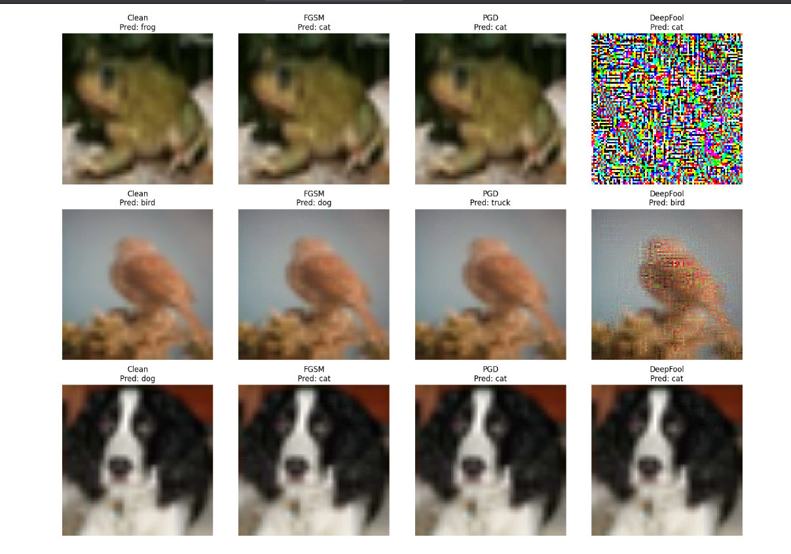

# Comparison of Adversarial Attacks and Mitigation Techniques on DNNs

This repository demonstrates a comprehensive comparison of adversarial attacks and their mitigation techniques on deep neural networks. A MobileNetV2 model, fine-tuned on the CIFAR-10 dataset, is used to evaluate the effectiveness of popular adversarial attacks and various defense methods in TensorFlow using Python.

## Features

- **Adversarial Attacks**:  
  - **FGSM**: Fast Gradient Sign Method
  - **PGD**: Projected Gradient Descent
  - **DeepFool**: Minimal perturbation attack
- **Mitigation Techniques**:  
  - **Input Transformation Methods**:
    - Gaussian Blur
    - Gaussian Noise
    - JPEG Compression
    - Reducing Bit Depth
  - **Adversarial Training**: Integrating adversarial examples during training to improve model robustness

## Technologies Used

- **TensorFlow**: Deep learning framework used for model training and adversarial attack implementations.
- **Python**: Programming language employed throughout the project.
- **MobileNetV2**: The model architecture, fine-tuned on the CIFAR-10 dataset.

## Usage

1. **Train the Model**: Fine-tune MobileNetV2 on CIFAR-10.
2. **Generate Adversarial Examples**: Run FGSM, PGD, and DeepFool attacks on the trained model.
3. **Apply Mitigation Methods**: Test various input transformation techniques and adversarial training to counter adversarial attacks.

> **Note:** Some PDF and notebook files may not display properly in your browser. Please download these files to view them correctly.

## Demo

Below is an example screenshot demonstrating adversarial examples produced by the attacks (these images show the transformed inputs and the model's predictions without mitigation techniques):

---

Happy experimenting and thank you for exploring adversarial attacks and their mitigation strategies!
